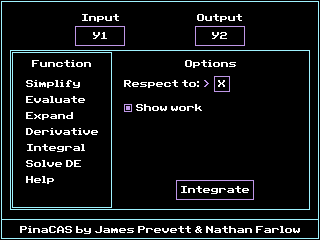
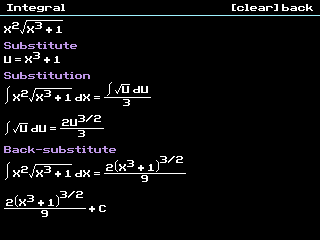
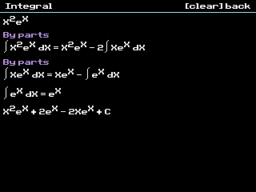
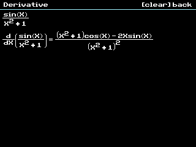
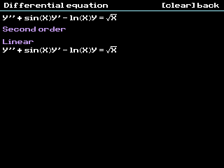

<h2 align="center"><b>PinaCAS</b></h2>
<p align="center">
<a href="https://github.com/james-pre/PinaCAS/actions/workflows/ci.yaml" alt="Build Status"></a>
</p>
<p>
PinaCAS is a computer algebra system for the TI-84 Plus CE calculators that shows its work. It is a fork of <a href="https://github.com/nathanfarlow/PineappleCAS">PineappleCAS</a> by Nathan Farlow, which provides the simplifier, identities, derivatives, and the calculator interface. PinaCAS adds integration and differential equations, in addition to aforementioned showing of work. Both use the <a href="https://github.com/creachadair/imath">imath library</a> for arbitrary precision math.
</p>

## Changes from PineappleCAS
- Indefinite integration: linearity, a table of elementary integrals, u-substitution, and integration by parts
- Step-by-step work for derivatives and integrals, shown in a scrollable viewer with fractions, exponents, roots, and integral signs drawn as in print
- Differential equations entered with primes, such as `Y''+2Y'=3X`, classified by order and linearity
- Integral and Solve DE functions in the GUI, and `INTEG` and `DE` commands in the TI-Basic interface
- Much faster simplification, especially when showing work
- Builds with the LLVM-based CE C toolchain, with imath as a git submodule

The program is still called PCAS on the calculator, and the existing TI-Basic commands are unchanged.

## Entering differential equations
Type the equation into a Y= variable or string. Write derivatives of the unknown function with primes from the ANGLE menu (2nd, APPS), and the equals sign from the TEST menu (2nd, MATH). For example, y'' + 16y = 0 is `Y''+16Y=0`. Choose the independent variable with "Respect to", which is X by default. Any letter can be the unknown function, so x'' + w²x = F cos(gt) is `X''+W²X=Fcos(GT)` with respect to T.

<hr>

## Screenshots






These are from PineappleCAS, and show the simplifier and the TI-Basic interface.


# Installation
* Download the latest release from the releases and send PCAS.8xp to your calculator's **archive memory**. It is very important that the program is archived to prevent Error: Memory when running the program.
* Download the latest C libraries from https://github.com/CE-Programming/libraries/releases and send to your calculator.
* If you have CE OS 5.3 or higher, simply execute prgmPCAS on the calculator. If not, you will have to unarchive PCAS and do Asm(prgmPCAS from the catalog.
* Navigate the GUI with the arrow keys, and press enter on GUI elements to change their value.
* Press clear to exit the program.

Note that if you encounter the error "Attempted to use a variable or function where it is not valid" on OS versions 5.5 or newer, this is because TI removed the ability to run ASM programs on these OS versions. This is not an issue with PinaCAS. You can jailbreak your calculator with [arTIfiCE](https://yvantt.github.io/arTIfiCE/) to restore the functionality and then try running PinaCAS again.

# Build
Download and install the latest CE C toolchain from https://github.com/CE-Programming/toolchain

On Fedora, `scripts/install-toolchain.sh` installs or updates it in `/opt/CEdev` (override with `CEDEV_PREFIX`), along with the matching `clibs.8xg` for the calculator.

**Compile for calculator:**
```
git clone --recursive https://github.com/james-pre/PinaCAS
cd PinaCAS
make
```
The calculator program compiles consistently on Ubuntu, but Windows has a problem with it. Executing make on Windows many times seems to work for some reason. (I blame the compiler!)

**Run in CEmu:**
```
scripts/emu.sh --libs
```
Builds PCAS, starts [CEmu](https://ce-programming.github.io/CEmu/) with the ROM at `tmp/TI84+CE.rom` (override with `CEMU_ROM`), sends the program, and launches it through Cesium. `--libs` also sends `clibs.8xg`, which is only needed once. Set `CEMU_CESIUM_APP` to Cesium's number in the APPS menu if it is not 4.

**Compile for PC:**
```
git clone --recursive https://github.com/james-pre/PinaCAS
cd PinaCAS
make -f pc.makefile
```
# TI-Basic interface

## Overview
You can call PCAS from within a basic program. The TI-Basic interface can do everything that is possible through the GUI. PCAS is very stable but there is always a chance of a RAM reset. This will cause a loss of all unarchived programs, including the one that is currently calling PCAS if it is not archived. More likely is that an input is too difficult for PCAS, and it will take too long for PCAS to terminate, necessitating a manual RAM reset on the back of the calculator. A way to work around this problem is to archive all programs, including PCAS, and use a shell like Cesium to edit archived programs.

## Usage
PCAS reads a command from the Ans variable. The command must be a string. PCAS ignores spaces in the string. 1 is written back to the Ans variable if the command is successful, or 0 if it is not. PCAS will automatically alert the user if there is a syntax error in the command that is passed, but it will fail silently if it is unable to perform a correctly formatted command and let the basic program handle the error by reading the Ans variable.

Some commands have optional boolean options, indicated by [optional boolean options] in the descriptions. These can be left off the command completely and will all be set as 1 by default. For example: SIMP,Y1,Y2 is the same as SIMP,Y1,Y2,111111. Boolean options are not separated by commas. See below for a list of commands and their usages.

**IMPORTANT: when specifying an input and output variable, use their TI tokens.** For example, when specifying Y1 as the input, select it from the function menu and **do not** type 'Y' then '1'. Valid variables are Y1 through Y0, Str1 through Str0, and Ans. In this case, Ans is useless because it will be overwritten by 1 or 0 when PCAS terminates anyway.

## Simplify
**Usage:** SIMP,[Input],[Output],[6 optional boolean options]

**Description:** Automatically simplifies like terms. Automatically takes derivative of any nDeriv() tokens if it can. Simplifies identities based on the boolean options passed.

**Options:** The boolean options indicate which simplification identities to use. If not included, the simplification command will use all identities.

Boolean options from left to right:
- Boolean 1: Use basic identities (inverses of functions and some simple log identities)
- Boolean 2: Use trig identities (periodic, double angle, and other trig identities)
- Boolean 3: Use hyperbolic identities
- Boolean 4: Use complex identities (Euler's identity, rewrites functions with complex arguments using complex logarithm)
- Boolean 5: Evaluate trig constants (Evaluate trig constants like sin(pi/2) = 1)
- Boolean 6: Evaluate inverse trig constants (Evaluate inverse trig constants like asin(-1) = -pi/2)

**Example program:**
```
:"Simplify Y1, put the result in Y2, using all identities. (Will be slow depending on input)"
:"SIMP,Y1,Y2"
:Asm(prgmPCAS)
:
:"Simplify Y1, put the result in Y2, use only trig identities and complex identities"
:"SIMP,Y1,Y2,010100"
:Asm(prgmPCAS)
```

## Evaluate
**Usage:** EVAL,[Input],[Output]

**Description:** Evaluates functions like int(X), abs(X), integer factorials, and integer bases to integer exponents.

**Example program:**
```
:"Evaluate all constants in Y1 and write result to Y2."
:"EVAL,Y1,Y2"
:Asm(prgmPCAS)
```

## Substitute
**Usage:** SUB,[Input],[Output],[Input to substitute from],[Input to substitute to]

**Description:** Substitutes an expression for another.

**Example program:**
```
:"Use the expression in Y1, Substitute any instance of Str1 with Str2, then write it to Y2."
:"SUB,Y1,Y2,Str1,Str2"
:Asm(prgmPCAS)
```

## Expand
**Usage:** EXP,[Input],[Output],[2 optional boolean options]

**Description:** Expands multiplication.

**Options:** The boolean options indicate what to expand. If not included, the expand command will expand both multiplication and powers. This function is unoptimized, and very, very slow. You have been warned!

Boolean options from left to right:
- Boolean 1: Expand multiplication (A+B)(C+D) or A(B+C+2)
- Boolean 2: Expand powers (A+B)^3

**Example program:**
```
:"Fully expand Y1 multiplication and powers and write the result to Y2."
:"EXP,Y1,Y2"
:Asm(prgmPCAS)
:
:"Expand only the powers of Y1 and write result to Y2."
:"EXP,Y1,Y2,01"
:Asm(prgmPCAS)
```

## Derivative
**Usage:** DERIV,[Input],[Output],[Variable respect to]

**Description:** Takes the derivative of input with respect to [Variable respect to] and writes the result to output. Valid variables are A-Z, and theta.

**Example program:**
```
:"Take the derivative of Y1 with respect to X and put the result in Y2."
:"DERIV,Y1,Y2,X"
:Asm(prgmPCAS)
```

## Integral
**Usage:** INTEG,[Input],[Output],[Variable respect to]

**Description:** Finds an antiderivative of input with respect to [Variable respect to] and writes the result to output. Parts that cannot be integrated are left as fnInt( with two arguments.

**Example program:**
```
:"Integrate Y1 with respect to X and put the result in Y2."
:"INTEG,Y1,Y2,X"
:Asm(prgmPCAS)
```

## Differential equation
**Usage:** DE,[Input],[Output],[Variable respect to]

**Description:** Classifies the differential equation in input, with [Variable respect to] as the independent variable. If it is linear, its standard form is written to output.

**Example program:**
```
:"Write the standard form of the differential equation in Y1 to Y2."
:"DE,Y1,Y2,X"
:Asm(prgmPCAS)
```

## Good things to know:
PCAS automatically calls SIMP,[Input],[Output],000000 after every command, so simplifying after is only necessary if you want to simplify further with identities.

Remember that you can definitely use strings as input and output as well. You can also check if PCAS was able to successfully execute the command. Here's an example incorporating both of those things:
```
:"Take derivative of Str1 with respect to B and write to Y1."
:"DERIV,Str1,Y1,B"
:Asm(prgmPCAS)
:If Ans
:Then
:Disp "SUCCESS!"
:Else
:Disp "FAIL :("
:End
```

## Credits

- James Prevett: PinaCAS
- Nathan Farlow: PineappleCAS, which PinaCAS is built on
- Michael J. Fromberger: the imath library
- Adriweb and Mateo: help and contributions to PineappleCAS

## Licensing

PineappleCAS is licensed under the MIT, all copyright belongs to Nathan for his amazing work on the original project.
This fork is licensed under the GPL.